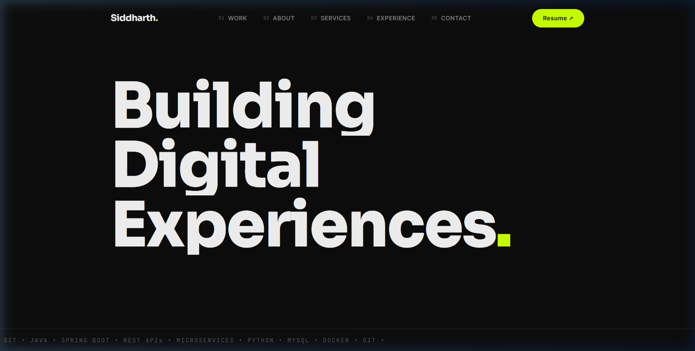

# Siddharth Bhadu — Software Engineer Portfolio

A modern, editorial portfolio built with vanilla HTML, CSS, JavaScript, and GSAP. Dark theme, typography-driven, fully responsive.

**[→ View Live Site](https://sidhu1512.github.io/)**

---



---

## ✨ Features

- **GSAP + ScrollTrigger Animations** — Smooth scroll-triggered reveals, staggered entrances, and counter animations
- **Parallax Photo Sections** — Immersive full-width photo dividers with depth scrolling effect
- **Custom Dual Cursor** — Animated dot + trailing circle with hover-aware interactions
- **Page Loader** — Letter-by-letter name reveal with progress bar
- **Responsive Design** — Adapts from mobile to ultrawide
- **Contact Form** — EmailJS-powered, no backend needed
- **Editorial Typography** — Sora (display) + Inter (body) + JetBrains Mono (code)

---

## 🛠️ Tech Stack

| Layer | Technology |
|-------|-----------|
| Structure | HTML5, Semantic Markup |
| Styling | CSS3, CSS Variables, Responsive Media Queries |
| Logic | Vanilla JavaScript |
| Animation | [GSAP](https://greensock.com/gsap/) + ScrollTrigger |
| Contact | [EmailJS](https://www.emailjs.com/) |
| Icons | [Boxicons](https://boxicons.com/) |
| Fonts | [Google Fonts](https://fonts.google.com/) (Sora, Inter, JetBrains Mono) |

---

## 📂 Project Structure

```
├── index.html              # Main page
├── favicon.svg             # Minimalistic "S." favicon
├── preview.png             # README preview screenshot
├── assets/
│   ├── css/
│   │   └── styles.css      # All styles + responsive breakpoints
│   ├── js/
│   │   └── main.js         # Animations, cursor, parallax, form
│   ├── img/                # Work previews + parallax photos (DSC)
│   └── file/
│       └── SidCV.pdf       # Resume
└── README.md
```

---

## ⚙️ Run Locally

```sh
git clone https://github.com/sidhu1512/sidhu1512.github.io.git
cd sidhu1512.github.io
npx serve .
```

Or just open `index.html` directly in a browser.

---

## 📄 License

MIT — Open source and free to use.

---

## 👋 Contact

**Siddharth Bhadu** — [GitHub](https://github.com/sidhu1512) · [LinkedIn](https://www.linkedin.com/in/siddharth-bhadu-71a483193) · [Email](mailto:siddharthbhadu.work@gmail.com)
